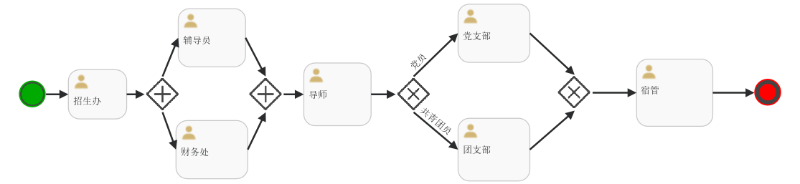

# 工作流

`gf-workflow` 是一个基于GoFrame2框架开发的微型流程引擎，开发目的是学习GoFrame框架并完成课程作业，后续有时间会完善和添加更多功能

# Features
- 基于GoFrame2框架，易扩展
- 仅使用mysql存储流程定义，无需BPML等业务流程建模语言的学习成本
- 结构简单，甚至抛弃了大部分GoFrame的工程目录结构，易于理解
- OpenAPIV3 自动生成可以直接操作的文档
- 类微服务的架构，可以直接调用API进行接入
- 可以实现会签、条件选择等特殊流程节点
- 测试驱动开发，覆盖了大部分的流程操作函数

# 安装使用

## 下载项目并安装依赖
```
git clone https://github.com/dark-wind/gf-workflow.git
cd gf-workflow
go mod tidy
```

## 初始化数据结构
导入 sql/workflow.sql

只有5张表，及其简单
## 运行
```
go run main.go
```
配置数据连接
```
nano config.yaml
```
修改数据库名和密码
```
database:
  default:
    link:  "mysql:yourname:yourpassword@tcp(127.0.0.1:3306)/workflow?charset=utf8mb4&parseTime=True&loc=Local"
```

# 演示示例

## mock一些用户和权限
```
go test .\internal\logic\user\
```

## mock 一些流程定义
```
go test .\internal\logic\processManage\
```

## 流程演示 
打开 http://localhost:8000/try
或者
http://localhost:8000/view/task
现在可以通过在线文档，或者演示界面，进行流程的流转测试了

### 演示流程示意图


### 演示界面

### 发起流程

### 并行节点


# Limitation
```
golang version >= 1.15
mysql version >=5.8 (使用了json类型，5.7是不支持的哟)
```

# 架构
现在分为用户管理、流程管理、流程引擎、演示界面，4个模块

# 代理设置
git config --global http.proxy http://127.0.0.1:7890
git config --global --unset http.proxy

#文档（基本等于没写）

## 核心路由
```

:8000   | POST   | /complete    | 完成当前task，推送到下一步          |                    
----------|--------|--------------|-----------------------------------------------------------------|--------------------
:8000   | POST   | /dispatch    | 转派当前任务给另一角色          |                    
----------|--------|--------------|-----------------------------------------------------------------|--------------------
:8000   | GET    | /list        | 获取指定用户应该处理的task列表              |                    
----------|--------|--------------|-----------------------------------------------------------------|--------------------
:8000   | GET    | /manage/list | 获取所有的可用流程  |                    
----------|--------|--------------|-----------------------------------------------------------------|--------------------
:8000   | POST   | /reject      | 驳回，驳回后task结束流程            |                    
----------|--------|--------------|-----------------------------------------------------------------|--------------------
:8000   | POST   | /start       | 发起一个流程，需要指定流程的模板，也可以追加相关数据进行判断             |                    
----------|--------|--------------|-----------------------------------------------------------------|--------------------
:8000   | ALL    | /swagger/*   | 原生的api文档             | HOOK_BEFORE_SERVE  
----------|--------|--------------|-----------------------------------------------------------------|--------------------
:8000   | GET    | /try         | 可以在线调用的api文档                                              |                    
----------|--------|--------------|-----------------------------------------------------------------|--------------------
:8000   | POST   | /update      | 修改task的相关数据的值        |                    
----------|--------|--------------|-----------------------------------------------------------------|--------------------
:8000   | ALL    | /view/task   | 演示专用界面                    |
```
## task的状态
task的状态现在有3种：
- run 正在流转
- finish 已完成
- fail 被驳回、已经中止，不能再处理

后面准备增加：
- rejected 被驳回到某个节点，可以再继续处理

